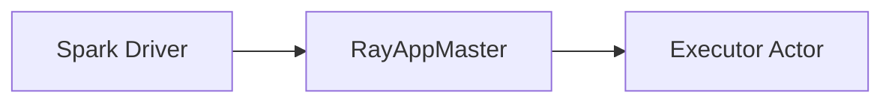

# ADR-NNNN: <Decision title in plain language>

- **Status:** Proposed | Accepted | Superseded by ADR-MMMM | Deprecated
- **Date:** YYYY-MM-DD (when the decision was made, not when this file was written)
- **Issue:** #NNN (optional)
- **PR:** #NNN (optional, the PR where the decision shipped)

## Context

What problem are we solving? Two or three sentences. Include the constraints that forced the decision — a Spark contract we have to honor, a Ray actor guarantee we cannot rely on, a version we have to keep supporting.

## Architecture

A single mermaid diagram of the components involved and how data or control flows between them. Required when the decision is structural — component layout, lifecycle sequencing, or where a responsibility lives. Skip it for naming conventions or a choice between equivalent representations.

Pick the type that matches the decision's shape:

- **`flowchart`** — how components wire together, what depends on what.
- **`sequenceDiagram`** — ordered interactions across the Spark driver, RayAppMaster, and executors. Use this for anything race- or ordering-sensitive.
- **`stateDiagram-v2`** — lifecycle and phase transitions (executor generations, actor slots).
- **`classDiagram`** — type relationships across the Scala and Python sides.

If the decision replaces a prior pattern, use side-by-side `subgraph Before[...]` / `subgraph After[...]` so the change is visible rather than inferred. Keep it around a dozen nodes, and use real names from the code.

## Decision

What we are doing, stated as a present-tense fact. One paragraph.

## Spark and Ray version impact

Which supported Spark lines this affects, what goes behind a shim in `core/shims/`, and whether the decision depends on Ray behavior that varies by version. State "none" if it is version-independent.

## Alternatives considered

For each non-trivial alternative:

- **Name of approach** — one sentence on what it would have been; one sentence on why we did not pick it.

List the alternatives a thoughtful reviewer would ask about, not straw men. If an alternative was "fix this upstream in Spark or Ray instead," say why it was not viable here.

## Consequences

What gets easier:

- ...

What gets harder:

- ...

What we will need to revisit:

- ...

## References

- Related plans in `doc/plan/`, prior ADRs, upstream Spark or Ray issues, PR threads.
