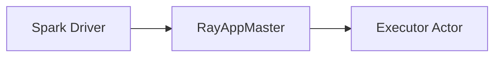

# <Title: the change, in plain language>

- **Status:** Draft | In review | Approved | Implemented | Superseded by <plan or ADR>
- **Date:** YYYY-MM-DD
- **Owner:** <who is accountable for this landing>
- **Issue:** #NNN (optional)
- **PR:** #NNN (optional, the implementation PR)
- **Implements ADRs:** <links to the already-merged decisions this plan schedules; "none" if it needs no new decision>

> Delete each guidance line as you fill the section in. Skip a section only when it genuinely
> does not apply, and say so in one line rather than deleting the heading — a reviewer needs to
> see what you chose not to write. Small changes will legitimately use a handful of these.
>
> **A plan schedules decisions that are already made.** Every ADR listed above must already be
> merged. If writing this plan surfaces a load-bearing decision that is not recorded yet, stop
> and land that ADR first — do not carry the decision inside the plan.

## Framing

### Tenets

_The two or three principles that break ties in this design, in priority order._

1.
2.

### Goal

_The outcome, in one or two sentences._

### Success metrics

_How we will know it worked. Measurable, with today's baseline and the target._

| Metric | Baseline | Target |
| ------ | -------- | ------ |
|        |          |        |

### Non-goals

_What this explicitly does not attempt._

### User impact

_Work backwards from the person calling `raydp.init_spark`. New or changed API, new Spark conf, different failure message, or nothing at all._

### Current behaviour

_How it works today and where the gap is. Cite real files, classes, and methods._

## Requirements

### Functional requirements

_Numbered, so tests and acceptance criteria can reference them._

- **FR1** —
- **FR2** —

### Non-functional requirements

_Latency, memory, executor-count scale, supported Spark and Ray versions._

- **NFR1** —

### Assumptions

_What you are taking as true — a Ray guarantee, a Spark contract, a cluster property. Unstated assumptions are the usual root cause of a plan failing review._

### Constraints

_What you cannot change: upstream APIs, the Java 8 target, wheel packaging, the CI matrix._

## Design

### Architecture

_A mermaid diagram of the components and main data flow, then a short walkthrough of the primary path. `flowchart` for wiring, `sequenceDiagram` for ordered interactions across driver / app master / executors, `stateDiagram-v2` for lifecycle phases._

### Data model / message shapes

_Case classes, RPC messages, and Python-facing types the change adds or touches._

### Interaction with existing components

_Who calls it and what it calls. Mark which side is Spark's contract, which is Ray's, and which is RayDP's own._

### Spark version impact

_Which supported lines are affected, what goes behind a shim in `core/shims/`, and whether the version matrix changes. State "none" if version-independent._

### Alternatives considered

_Each realistic option, its trade-off, and why it lost. Include "fix it upstream in Spark or Ray" and say why that was not viable. Summarise here only — if the choice constrains future work, it belongs in an ADR that lands **before** this plan, and this section just cites it._

- **Approach** — what it would have been; why we did not pick it.

### One-way doors

_Decisions expensive to reverse: public Python API names, Spark conf keys, wire and on-disk formats, anything users pin against. Justify each. Everything else is reversible — do not over-engineer it._

## Risk and operations

### Edge cases & failure modes

_Enumerate them and state how each is handled. Executor loss, actor restart, and driver disconnect belong here whenever lifecycle code is in scope._

| Case | Handling |
| ---- | -------- |
|      |          |

### Blast radius

_Who is affected when this goes wrong: every user on the default path, only dynamic-allocation users, only one Spark line. Say whether the change is on by default._

### Scaling / performance

_The bottlenecks and how the design contains them, as requirements not observations. Answer "what breaks at 10x" concretely — at 1,000 executors, which map, loop, or RPC hurts first._

### Security & privacy

_Credentials, tokens, and user data the change touches. What must never reach a log, an exception message, or the Ray object store._

### Diagnosability

_What the change logs through Spark's `Logging` trait and at which level, and how someone debugging a live cluster confirms the new behavior. A failure mode with no way to observe it is not handled._

### Cost

_Extra actors, memory, object-store traffic, or CI time. "Negligible" is a fine answer; silence is not._

### Dependencies

_Upstream versions required, other PRs that must land first, anything owned by someone else._

## Delivery

### Files

_Explicit new/edit list, repo-relative._

| File | Change |
| ---- | ------ |
|      |        |

### Testing

_The test catalog mapped to the real gate: `./build.sh`, then named `pytest` files. Reference the numbered requirements. Must satisfy the Testing Bar in AGENTS.md — in particular, state how each test fails without the change._

| Test | Covers | Level |
| ---- | ------ | ----- |
|      |        |       |

### Rollout & compatibility

_On by default or behind a Spark conf. What happens to a user on the previous version. What breaks, and what is deprecated rather than removed._

### Rollback

_How a user or maintainer backs out: flip the conf, pin the previous wheel, revert cleanly. If rollback is not possible, that is a one-way door — move it above._

### Docs to update

_`doc/` pages, `README.md` if user-facing APIs change._

### Out of scope / downstream

_What is deferred on purpose and where it is tracked._

### Phased approach

_Sequenced phases, each independently shippable where possible, with the concrete change and outcome for each._

- **Phase 1** — change; outcome.

### Open questions

_What is still undecided and who decides it. Scheduling and sequencing questions are fine here. A load-bearing design decision is not — that means an ADR is missing, and it should land before this plan is approved._

### FAQ

_The objections a reviewer will raise, answered pre-emptively. "Why not just do X" goes here._

**Q:**
**A:**

### Appendix

_Benchmark output, logs, upstream source excerpts. Keep the main body readable by moving evidence here._
